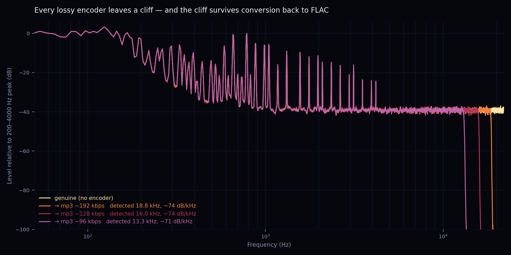
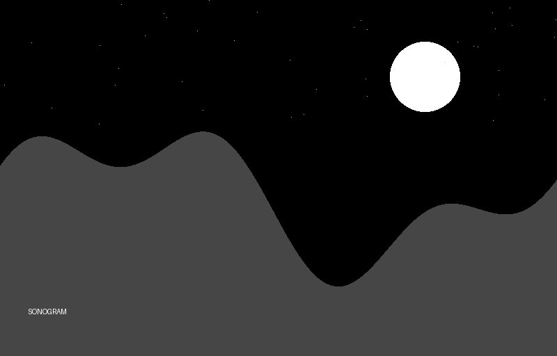
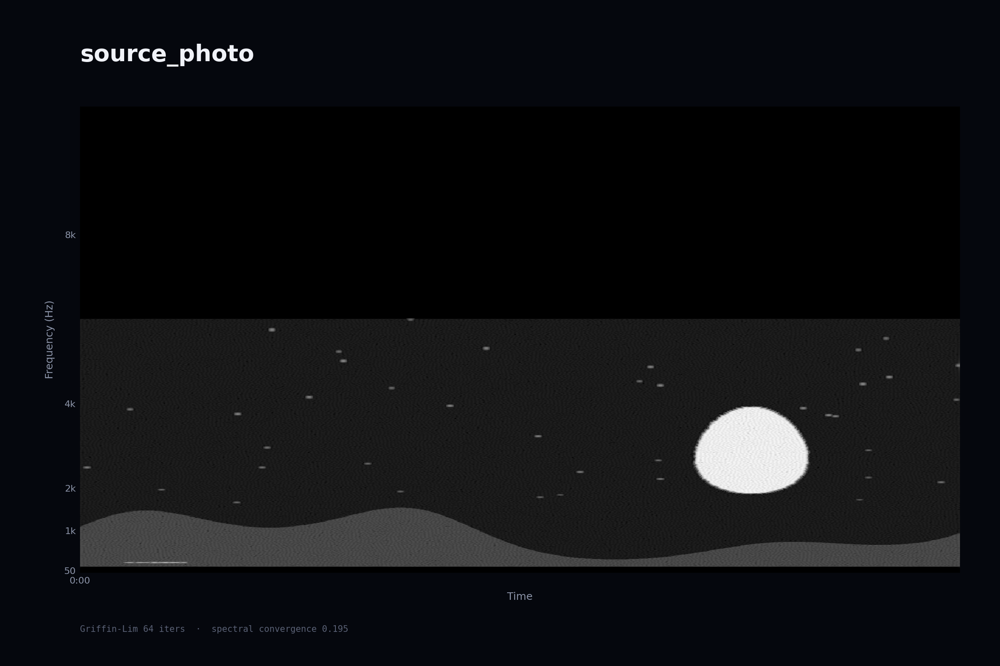
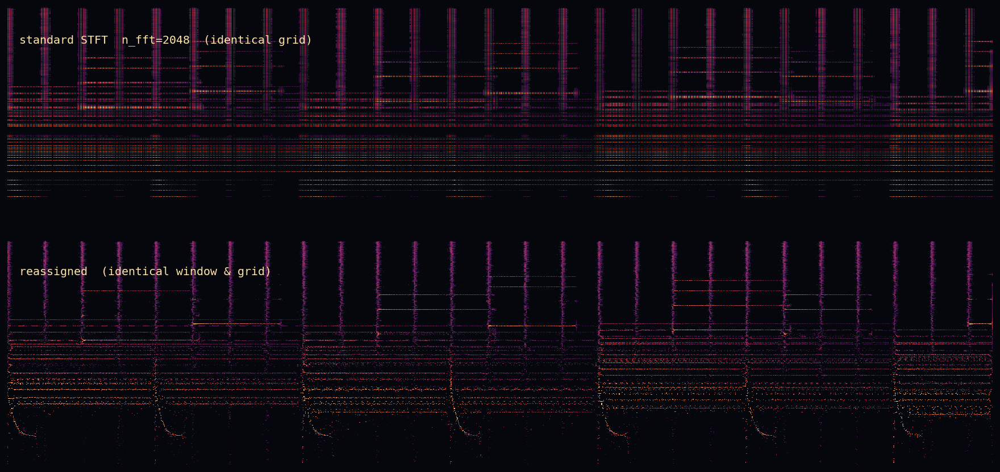
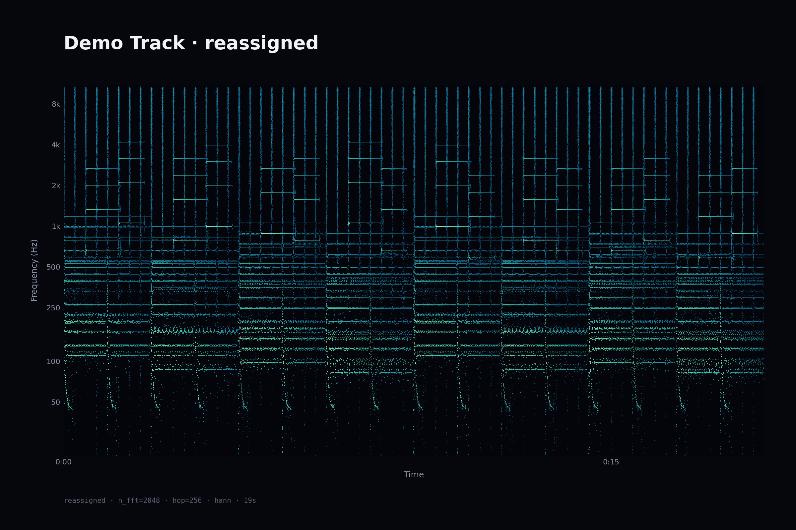
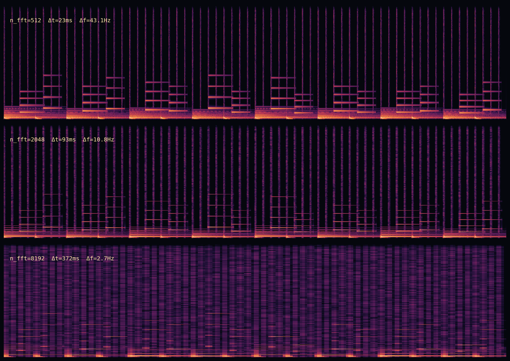

# spectral-forensics

[](https://github.com/shianjeng/spectral-forensics/actions/workflows/test.yml)
[](LICENSE)
[](pyproject.toml)

**Is that FLAC actually a re-wrapped mp3?** Every lossy encoder throws away
everything above a cutoff, and that cliff survives conversion back into a
lossless container. This scans a whole library and tells you which files to
look at — and it says out loud what it cannot catch.

**[→ Try it in your browser](https://shianjeng.github.io/spectral-forensics/)**
— drop a file in, nothing is uploaded.



*One source, encoded at three bitrates, then converted back to FLAC. Below the
cutoff the four curves are indistinguishable; above it, each encoder's brick
wall stands where the detector says it does. Reproduce it yourself with
`python examples/make_audit_figure.py`.*

That detector is one of four things built on the same spectral machinery. The
other three: editing sound in the frequency domain and inverting back to a
waveform, sharpening a spectrogram past the time–frequency uncertainty limit,
and rendering posters and spectrum video.

---

## Install

```bash
pip install spectral-forensics
```

Python 3.11 or newer. Installs as `spf` (or the full `spectral-forensics`).
`ffmpeg` is optional — it is needed for video output and for decoding some
mp3/m4a files. Check what you have:

```bash
spf check
```

From source, if you want the examples and tests:

```bash
git clone https://github.com/shianjeng/spectral-forensics.git
cd spectral-forensics
python3 -m venv .venv && source .venv/bin/activate
pip install -e ".[dev]"
python examples/make_demo_audio.py      # the demo track used below
```

---

## What it does

| Command | Purpose |
|---|---|
| `audit` | Detect lossy transcodes across a music library |
| `edit` | Edit in the frequency domain, reconstruct with the original phase |
| `sonify` | Encode an image into a spectrum and resynthesise it as audio |
| `reassign` | Reassigned spectrogram — resolution beyond Δt·Δf ≥ 1 |
| `poster` | Static sonogram (STFT / mel / CQT) |
| `video` | Spectrum video with the original audio muxed in |
| `compare` | Side-by-side window-length comparison |
| `check` | Report the environment: Python version, ffmpeg, which features work |

---

## 1. Is it really lossless?

```bash
spf audit ~/Music --recursive --verbose
```

```
✓ 01 - genuine.flac         cut= 22.1k
⚠ 02 - suspicious.flac      cut= 16.0k   90%  → mp3 ~128 kbps
? 03 - borderline.flac      cut= 18.8k   55%  → mp3 ~192 kbps
· 04 - honest.mp3           cut= 16.0k
```

### Try it without installing anything

[shianjeng.github.io/spectral-forensics](https://shianjeng.github.io/spectral-forensics/)
runs the same cutoff, steepness and intensity-stereo tests in the browser
using the Web Audio API. The file is decoded and analysed locally and never
leaves the machine. `tests/test_web_parity.py` feeds identical signals to both
implementations and asserts they land on the same FFT bin.

Porting it paid for itself immediately: the JavaScript version disagreed with
Python on a 16 kHz brick wall, and **Python was the one that was wrong**.
`librosa.stft` pads both ends by default, and the step at the padding boundary
is broadband, so the first and last frames have a full spectrum. On short
clips those two frames carry enough weight in the 95th percentile to hide the
cutoff entirely. Passing `center=False` fixed it and made the result
independent of clip length.

Three independent pieces of evidence, because any one alone produces false
positives — old recordings and solo acoustic material genuinely lack high
frequencies:

1. **Cutoff frequency** — the highest frequency still carrying real energy,
   from a 95th-percentile long-term spectrum. A percentile rather than a
   mean, because quiet passages drag the mean into the noise floor, while a
   plain maximum chases single transients.
2. **Steepness** — how much further the level falls within 1 kHz above the
   cutoff. An encoder's brick wall drops 20 dB or more; natural rolloff does
   not.
3. **Intensity stereo** — lossy codecs collapse L/R into mono-plus-weight at
   high frequencies, so the side signal `(L−R)/2` vanishes above some
   frequency. Independent of the lowpass, and hard to fake.

Verdicts come in three tiers: `⚠ suspect` (a lowpass **and** a brick wall,
usually landing on a known encoder cutoff), `? likely` (a lowpass with no
corroborating evidence), and `✓ clean`. The middle tier exists so that
genuinely dull recordings are flagged for a listen rather than accused.

It also catches the reverse: an mp3 declaring 320 kbps whose spectrum only
supports 128 kbps was re-encoded from a low-bitrate source.

### Validation

Ground truth built with ffmpeg — one source encoded at several cutoffs, then
converted back to FLAC:

| File | True cutoff | Detected | Verdict |
|---|---|---|---|
| `original.wav` | none | 22.1 kHz | ✓ clean |
| `genuine.flac` | none | 22.1 kHz | ✓ clean |
| `cut_15000.flac` | 15.0 kHz | 15.3 kHz | ⚠ → ~112 kbps |
| `cut_16000.flac` | 16.0 kHz | 16.0 kHz | ⚠ → ~128 kbps |
| `cut_17500.flac` | 17.5 kHz | 17.4 kHz | ⚠ → ~160 kbps |
| `cut_19000.flac` | 19.0 kHz | 18.8 kHz | ⚠ → ~192 kbps |

### Compared with existing tools

[Spek](https://www.spek.cc/) draws you a spectrogram and leaves the judgement
to you — excellent for a single file, useless for a library of forty thousand.
*fakin' the funk?!* automates the judgement but is closed-source and
Windows-only. This project gives you an open-source CLI that scans a whole
tree, reports the implied bitrate, exports a shareable HTML report, and — the
part most tools skip — states its own failure modes.

### Batch reports

```bash
spf audit ~/Music --recursive --html report.html
```

A single self-contained HTML file: every flagged track gets its own long-term
spectrum with the detected cutoff marked, so the evidence travels with the
verdict instead of scrolling out of a terminal.

### The 20 kHz problem

A steep rolloff is not proof of compression. Mastering chains and some ADC
anti-aliasing filters lowpass the signal too, and one of the places they do it
is around 20 kHz — which is also where LAME puts the cutoff at 320 kbps. In the
frequency domain those two are the same picture.

Measured on synthetic lossless files with a brick wall at various frequencies:

| Lowpass | Verdict |
|---|---|
| 21.5 kHz | ✓ clean |
| 21.0 kHz | ✓ clean |
| 20.5 kHz | ? likely |
| 20.0 kHz | ? likely |
| 19.0 kHz | ⚠ suspect |
| 16.0 kHz | ⚠ suspect |

Two rules keep this honest. Anything within 1.2 kHz of Nyquist counts as full
band, so an ADC filter at 21 kHz never scores at all. And between 19.8 and 21.6
kHz the "lands on a known encoder cutoff" bonus is withheld and the verdict is
capped at `likely` unless something independent of the lowpass — intensity
stereo — corroborates it. The ground-truth table above is unchanged by these
rules: every genuinely transcoded file is still caught.

Credit for the question goes to a reader who pointed out that ADCs brickwall
too. They were right that the reasoning needed stating; the specific case they
raised (21 kHz) was already handled, and looking into it found the real gap at
20 kHz.

### Known limitation

Encoders that apply **no** hard lowpass — ffmpeg's native AAC at higher
bitrates, Opus — slip past the cutoff test, and in a bench run the tool
called such a file clean. The lowpass-independent test currently shipped
(intensity stereo) does not help for mono material. Spectral-hole and
MDCT-periodicity detectors were prototyped and **did not separate the classes
on the test material**, so they are not shipped. Read a `✓` as "no lowpass
evidence", not as proof of provenance.

---

## 2. Invertible editing

The spectrogram stops being the end of the pipeline and becomes an editable
medium. Two reconstruction paths, for two different situations:

**Phase-preserving** (`edit`) — only the magnitude is changed, the original
phase is kept, and the inverse STFT runs directly. Every masking operation
goes this way. With an identity mask the round trip is exact to within
numerical precision:

```
||y' − y|| / ||y||  =  1.3e-08      (−158 dB)
```

```bash
spf edit track.wav --reject 2000:4000          # drop a band
spf edit track.wav --keep 80:250               # isolate the bass
spf edit track.wav --denoise
spf edit track.wav --mask painted.png          # paint in any image editor
```

Band rejection measured on a three-tone mixture: target band down more than
30 dB, neighbouring bands within 5 % of their original energy.

Denoising is spectral gating with a **minimum-statistics** noise floor — for
each frequency bin, a low percentile across the whole file, on the assumption
that every bin falls quiet at some point. Honest numbers on a noisy version
of the demo track:

| Input SNR | After | Δ |
|---|---|---|
| 17.0 dB | 16.9 dB | −0.2 |
| 9.1 dB | 11.8 dB | **+2.7** |
| 3.1 dB | 6.5 dB | **+3.4** |

It helps when there is real noise and mildly hurts when there is not — the
gate's own distortion outweighs what it removes. Stationary material (a tone
that never stops) breaks the minimum-statistics assumption outright, since
the tone estimates itself as the noise floor; pass an explicit noise region
instead.

**Griffin-Lim** (`sonify`) — when the magnitude is invented, no phase exists
to keep. Griffin-Lim alternates projections between "is a real signal" and
"has this magnitude" until a self-consistent phase falls out. It only
converges to a local solution, so a metallic quality is inherent, not a bug.

```bash
spf sonify photo.jpg --preview roundtrip.png
```



*Input: an ordinary greyscale picture.*



*Output, round-tripped: the picture encoded as a magnitude spectrum,
resynthesised into a 10-second wav, then re-analysed from the audio alone.
The ridge, moon and stars survive the trip.* Spectral convergence falls
0.345 → 0.241 → 0.207 → 0.196 at 1 / 8 / 32 / 64 iterations.

---

## 3. Reassigned spectrogram

A pure tone always draws as a *band* in a normal spectrogram. That width is
imposed by the window, not by the signal — a direct consequence of

```
Δt = n_fft / sr     Δf = sr / n_fft     Δt · Δf = 1
```

But an STFT bin carries more than a magnitude: it carries a phase. Taking
partial derivatives of that phase recovers where the energy inside the bin
actually sits:

```
instantaneous frequency   ω̂ = ω − ∂φ/∂t
group delay               t̂ = t + ∂φ/∂ω
```

Move each bin's energy from its cell to `(t̂, ω̂)` and the picture becomes
sharper than the uncertainty bound. This is not a violation: the bound
constrains the *width of a single time–frequency atom*, not the *precision
with which you can estimate the location of its energy* — the same
distinction that lets centroid localisation beat the diffraction limit in
microscopy.

```bash
spf reassign track.flac --hop 256 --side-by-side
```



*Same audio, same window, same grid. Top: conventional STFT. Bottom: after
reassignment. The harmonics collapse to hairlines and the kick drum's pitch
glide — invisible above — becomes a readable curve.*

```
sharpness (spectral concentration): standard 5.116 → reassigned 5.389
```

A test states the claim numerically rather than leaving it to the eye: for a
1 kHz tone with `n_fft=2048` at 22.05 kHz (Δf = 10.8 Hz), the
magnitude-weighted spread of reassigned frequency estimates stays **under one
FFT bin**.

Where it fails: reassignment relies on the phase derivative being
meaningful, so overlapping partials and low-SNR regions scatter. Anything
below `--mag-top-db` is discarded rather than plotted as noise.



---

## 4. Posters, video, window comparison

```bash
spf poster  track.mp3 --transform cqt --palette bloom
spf video   track.mp3 --size 1920x1080 --fps 30 --bars 128
spf compare track.mp3 --n-ffts 512,2048,8192
```



Short windows resolve every drum hit and smear the chords; long windows pin
the harmonics to a few Hz and smear every transient across 372 ms. Δt·Δf = 1
throughout — no setting wins both.

Video frames are rasterised in pure NumPy and piped straight into `ffmpeg`
over `stdin`: no matplotlib per frame, no intermediate PNGs, faster than
realtime at 1280×720 / 30 fps.

Palettes (`ember`, `abyss`, `mono`, `bloom`) are perceptually monotonic.
`jet` is deliberately absent — its non-uniform lightness invents banding that
is not in the data.

---

## Layout

```
spectral_forensics/
├── io.py          decode → mono → resample (ffmpeg fallback for m4a)
├── transform.py   STFT / mel / CQT      (numpy in, numpy out)
├── reassign.py    phase-derivative reassignment + rasterisation
├── invert.py      masking, spectral gating, Griffin-Lim, image → audio
├── audit.py       cutoff / steepness / intensity-stereo forensics
├── render.py      matrix → image        (no audio code)
├── video.py       ffmpeg pipe
└── cli.py         argparse entry point
```

`transform.py` never imports matplotlib and `render.py` never imports
librosa, so either half is usable alone.

## Tests

```bash
pytest -q     # 55 passed
```

CI runs the suite on Python 3.11 and 3.12 on every push.

What the suite asserts, beyond "it doesn't crash": Δt·Δf = 1 across window
lengths; a 1 kHz tone peaking within one FFT bin; reassignment measurably
sharpening a chirp on an identical grid; synthetic brick-wall cutoffs at
12/16/19 kHz recovered to within 500 Hz; a gentle 6 dB/oct rolloff *not*
being flagged as an encoder cutoff; an exact STFT→ISTFT round trip; band
rejection leaving neighbouring bands intact; and Griffin-Lim error decreasing
monotonically with iteration count.

There are also CLI smoke tests that execute every subcommand. They exist
because `--help` passing proves nothing — argparse never invokes the handler,
so a subcommand whose handler had been deleted sailed through a `--help`
sweep and shipped broken.

### What CI caught

Two real defects, both invisible on the development machine:

- **`audit` crashed with `NameError`.** Its handler's `def` line was lost in
  an earlier edit, leaving the body as unreachable code inside another
  function. The CLI smoke tests now cover this.
- **Griffin-Lim broke on librosa 0.x.** The code passed librosa 1.0's `rng`
  argument while `pyproject.toml` declared `librosa>=0.10`, where the same
  argument is called `random_state`. Anyone installing within the declared
  range hit a `TypeError`. The 3.11 job resolved an older librosa and
  surfaced it; the seeding keyword is now detected at runtime.

Both share a shape worth naming: the declared support range was wider than
the code actually supported, which is exactly the gap a single development
environment cannot see.

## References

The algorithms here are not mine; the implementation and the validation are.

- K. Kodera, R. Gendrin, C. de Villedary (1978). *Analysis of time-varying
  signals with small BT values.* IEEE Trans. ASSP **26**(1), 64–76. — the
  original reassignment idea.
- F. Auger, P. Flandrin (1995). *Improving the readability of time-frequency
  and time-scale representations by the reassignment method.* IEEE Trans.
  Signal Processing **43**(5), 1068–1089. — the general framework this
  implementation follows.
- D. Griffin, J. Lim (1984). *Signal estimation from modified short-time
  Fourier transform.* IEEE Trans. ASSP **32**(2), 236–243. — the phase
  reconstruction used by `sonify`.
- R. Martin (2001). *Noise power spectral density estimation based on optimal
  smoothing and minimum statistics.* IEEE Trans. Speech and Audio Processing
  **9**(5), 504–512. — the noise floor used by `edit --denoise`.
- J. Brown (1991). *Calculation of a constant Q spectral transform.* JASA
  **89**(1), 425–434. — the basis of `--transform cqt`.

## Roadmap

- Psychoacoustic masking overlay — dim what is physically present but
  inaudible, which is exactly what the encoder decided to throw away
- A lowpass-independent transcode detector that survives validation
- Interactive painting UI instead of round-tripping through a PNG mask

## Licence

MIT. The demo track is generated by `examples/make_demo_audio.py`; do not
commit commercial recordings to this repository.
